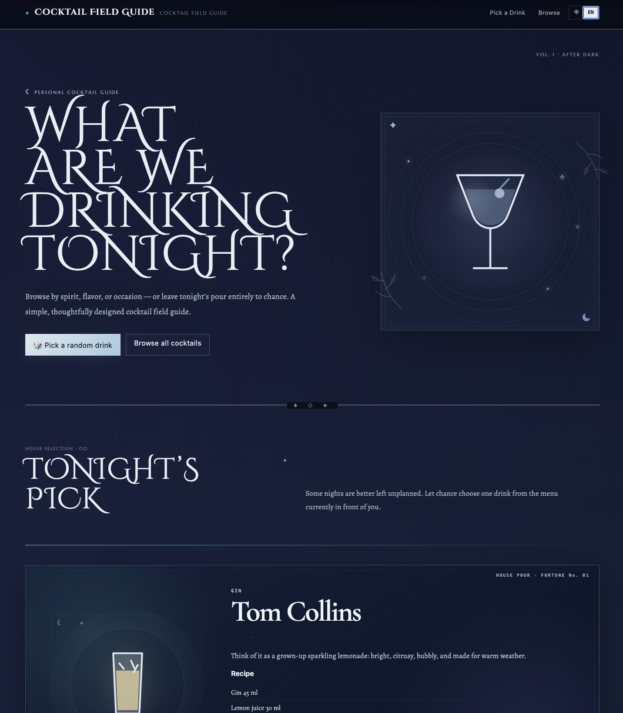

# Cocktail Field Guide

[](https://my-cocktails.xiangdi-lin.workers.dev/)
[](#)
[](#)
[](#)

A bilingual interactive cocktail guide for exploring classic and modern drinks by spirit, flavor, and occasion — or simply letting chance decide what to drink tonight.

## Live Demo

**[View the deployed site](https://my-cocktails.xiangdi-lin.workers.dev/)**



---

## Overview

Cocktail Field Guide is a lightweight personal-use website built around a simple question:

**What should I drink tonight?**

The site brings together **75 classic and modern cocktails** in a single searchable and filterable interface. Each drink includes structured information such as ingredients, preparation method, glassware, garnish, flavor profile, recommended occasions, and bilingual descriptions.

The project is intentionally lightweight and runs entirely in the frontend without a backend, database, authentication system, or external cocktail API.

---

## Design Goals

### 1. Fast discovery

The interface is designed around a simple flow:

**Browse → Filter → Discover → Read**

Users can explore cocktails through:

- Search
- Base-spirit filters
- Flavor filters
- Occasion filters
- Random selection

### 2. Bilingual usability

The site supports:

- A **Chinese-English mixed version** for personal use
- A **fully English version** for broader sharing

The language switch updates descriptions, ingredients, preparation instructions, labels, and supporting content across the interface.

### 3. Popularity-aware ordering

Cocktails are assigned internal popularity scores so more widely recognized drinks appear earlier in:

- The main collection
- Search results
- Filtered results

### 4. Distinct visual identity

The visual direction combines:

**Art Deco cocktail menu × midnight editorial × scrapbook collage**

The interface uses dark nighttime backgrounds, decorative serif typography, irregular pinned-note cards, translucent tape, pushpins, hand-drawn flourishes, star motifs, and custom cocktail illustrations.

---

## Key Features

### Cocktail Discovery

- Curated collection of **75 classic and modern cocktails**
- Search across:
  - Chinese and English names
  - Ingredients
  - Base spirits
  - Flavor tags
  - Occasion tags
- Multi-dimensional filtering by:
  - Base spirit
  - Flavor
  - Occasion
- Expandable **More Filters** for less common categories
- Popularity-based result ordering
- Filter-aware **random cocktail selector**

### Cocktail Details

Each cocktail includes:

- Recipe and measurements
- Preparation method
- Glassware
- Garnish
- Base spirit
- Flavor tags
- Recommended occasions
- Short description
- Visual 1–5 flavor ratings

### Visual & Interaction Design

- Custom inline **SVG cocktail illustrations**
- Irregular scrapbook-style cocktail cards
- Muted nighttime paper palette
- Decorative typography and hand-drawn strokes
- Responsive desktop, tablet, and mobile layouts
- Scroll-triggered reveal animations
- Staggered card entrances
- Random drink transitions
- Animated detail views
- Support for `prefers-reduced-motion`

---

## Architecture

The site uses a simple static architecture:

```text
Cocktail Data
      ↓
Vanilla JavaScript
      ↓
Search / Filter / Sort / Random Selection
      ↓
Dynamic HTML Rendering
      ↓
CSS + SVG Visual System
      ↓
Cloudflare Workers
```

## Future Ideas

Potential extensions include:

My Bar ingredient matching; One Ingredient Away recommendations; Ingredient unlock suggestions; Favorites; Serving-size scaling; Expanded cocktail notes and illustrations

## Notes

Cocktail recipes and proportions may vary across bartending traditions and individual bars. This project is intended as a personal reference and exploration tool.

Please enjoy responsibly.
