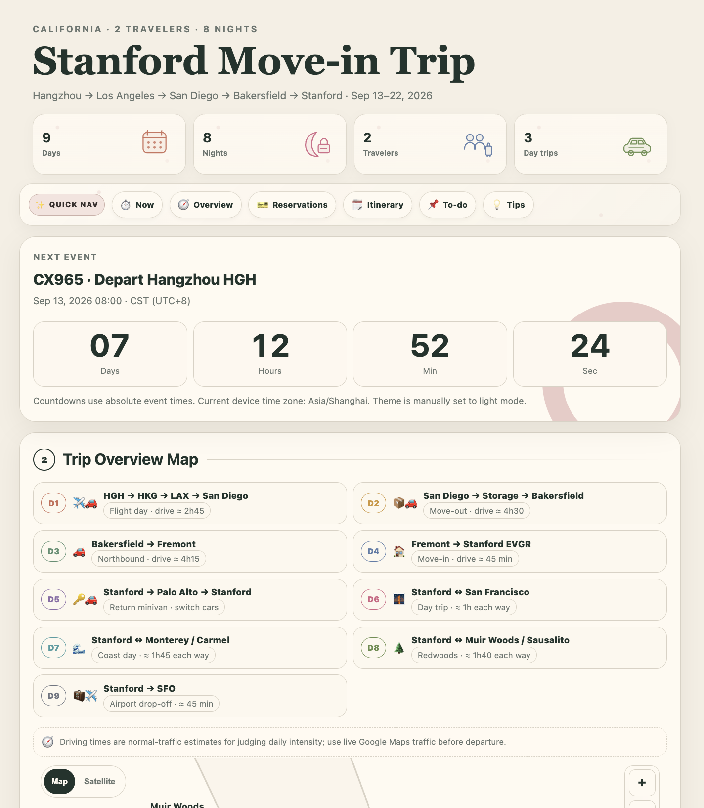

# California · Stanford Move-in Trip

A bilingual, mobile-first travel dashboard built for a real California relocation and Stanford move-in journey.

The project organizes a multi-day itinerary involving international flights, rental cars, hotels, relocation logistics, university housing check-in, shopping, sightseeing, dining, and airport transportation into a single interactive interface designed for practical use during travel.

## Live Demo

**[View the deployed site](https://california-trip-2026.xiangdi-lin.workers.dev)**

---

## Overview

This project was created to support a real relocation from San Diego to Stanford University in September 2026. The main travel route is:

**Hangzhou → Hong Kong → Los Angeles → San Diego → Bakersfield → Fremont → Stanford**

The trip combines several different types of planning:

- International air travel
- Airport arrival and rental-car pickup
- Long-distance driving through California
- Retrieving stored belongings in San Diego
- Overnight hotel stays
- Stanford graduate housing move-in
- Resident parking logistics
- Local shopping and move-in supplies
- Bay Area sightseeing
- Restaurant planning
- Final airport drop-off at SFO

Rather than keeping this information across reservation emails, screenshots, notes, map searches, and separate booking pages, I designed a single travel interface that consolidates the most useful information into one place.

The project is intentionally lightweight and practical. It is not intended to replicate a full travel-planning platform. Instead, it focuses on reducing friction during the trip by surfacing the right information at the right time.

---

## Design Goals

The project was developed around several practical constraints.

### 1. Mobile-first use

The site is primarily intended to be opened on a phone while traveling. The interface therefore prioritizes:

- Fast scanning
- Large tap targets
- Compact information density
- Clear visual hierarchy
- Minimal navigation depth
- Responsive layouts
- Low loading overhead

### 2. Real-world scheduling constraints

The itinerary contains several fixed anchors, including:

- International flights
- Rental-car pickup and return
- Hotel check-in and checkout
- Stanford housing check-in
- Attraction reservations
- Airport departure

These fixed events are treated as hard scheduling constraints, with flexible activities planned around them.

### 3. Cross-time-zone reliability

The trip moves from China and Hong Kong to California. All major timed events use explicit UTC offsets rather than relying only on browser-local time. This allows the countdown and scheduling logic to remain correct when the site is opened:

- Before departure in China
- During the Hong Kong connection
- After arrival in California
- On devices configured to different time zones

### 4. Public privacy

The website is publicly accessible, so only information needed for planning and navigation is shown. Sensitive data is intentionally excluded.

### 5. Offline resilience

The core site remains a single static HTML file with inline CSS, JavaScript, and SVG. The default map experience is available without loading external mapping libraries. Online features are loaded only when explicitly requested.

---

## Key Features

### Time-Aware Trip Planning

- **Live next-event countdown**  
  Automatically identifies the next scheduled event and displays a real-time countdown using explicit time-zone-aware timestamps across China, Hong Kong, and California.

- **Persistent bilingual interface**  
  Supports full **Chinese / English switching**, with the selected language saved locally for future visits.

- **Automatic + manual light/dark mode**  
  Automatically adapts to the device's local time while also allowing manual theme switching, with user preferences stored locally.

---

### Interactive Maps & Navigation

- **Geographically scaled California itinerary map**  
  Places major trip destinations according to real coordinates and uses day-specific route overlays to visualize the overall journey.

- **Map / Satellite switching**  
  Uses a lightweight offline vector map by default, while satellite imagery is loaded only when requested.

- **Interactive map controls**  
  Supports **zooming, panning, double-click zoom, and reset controls** on both the trip overview and individual daily route maps.

- **One-click Google Maps navigation**  
  Provides direct navigation links for destinations, hotels, rental-car locations, attractions, shopping stops, and multi-stop daily routes.

---

### Context-Aware Travel Resources

- **Dining recommendations within the itinerary**  
  Adds location-aware **Yelp restaurant recommendations** directly to relevant meal stops.

- **Nearby shopping and grocery links**  
  Integrates direct links to nearby supermarkets, shopping centers, and move-in supply stores where they are needed in the itinerary.

- **Reservation and action status system**  
  Uses a consistent visual status system for:
  - Confirmed reservations
  - Pending items
  - Action needed
  - Recommended advance bookings
  - Required reservations

---

### Mobile-First Interface

- **Quick Nav**  
  Provides fast access to:
  - Current status
  - Trip overview
  - Reservations
  - Daily itinerary
  - To-do items
  - Travel tips

- **Custom inline SVG illustrations**  
  Uses lightweight SVG graphics for trip statistics, route visualization, and supporting interface elements without requiring additional image assets.

- **Optimized information hierarchy**  
  Designed around fast mobile scanning, clear visual grouping, compact layouts, and minimal interaction overhead.

---

### Privacy & Deployment

- **Privacy-aware public design**  
  The public-facing version intentionally excludes sensitive information such as:
  - Passport and identity details
  - Reservation and ticket numbers
  - Access codes
  - Payment information
  - Exact residential unit information

- **Automatic deployment with GitHub + Cloudflare Workers**  
  The project is connected to GitHub so updates are automatically deployed to the live site whenever the repository changes.
